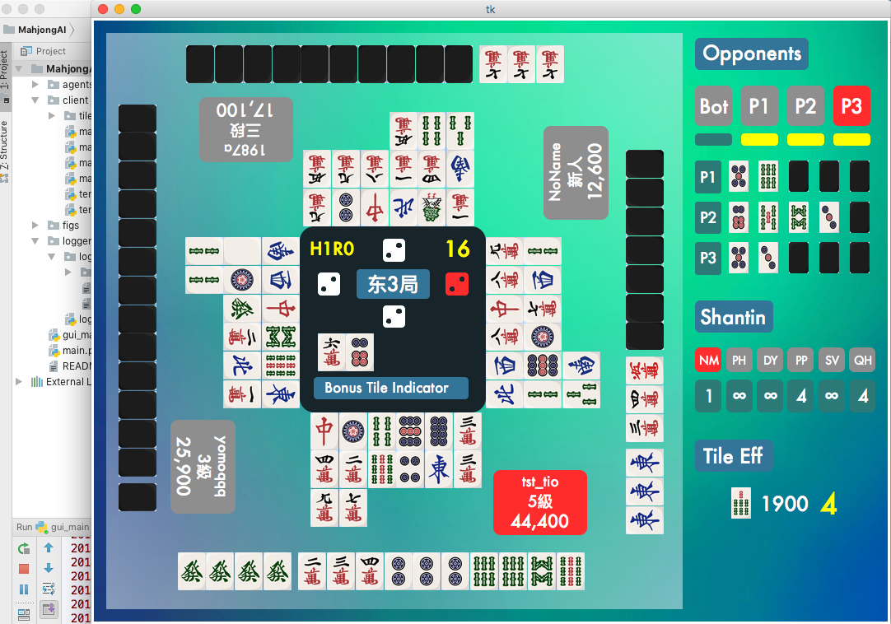
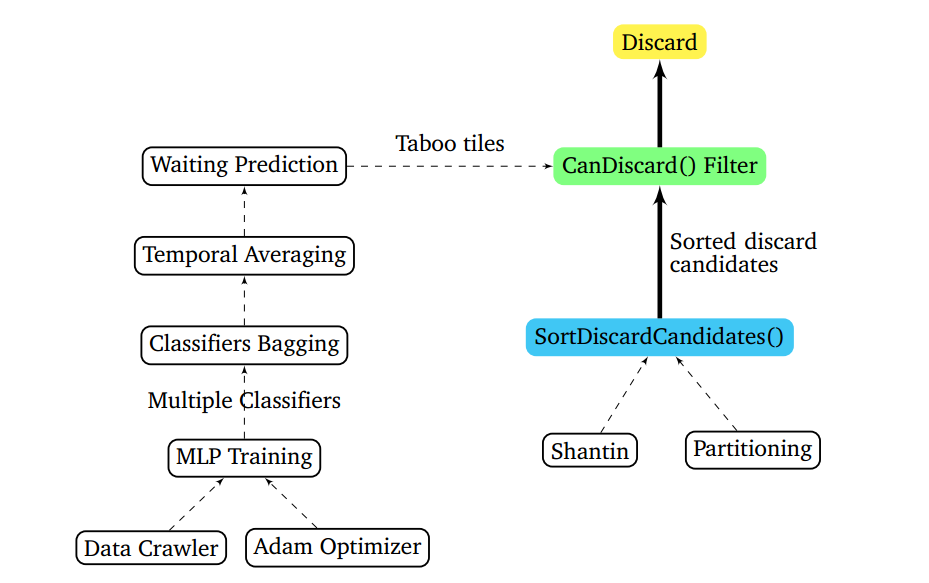
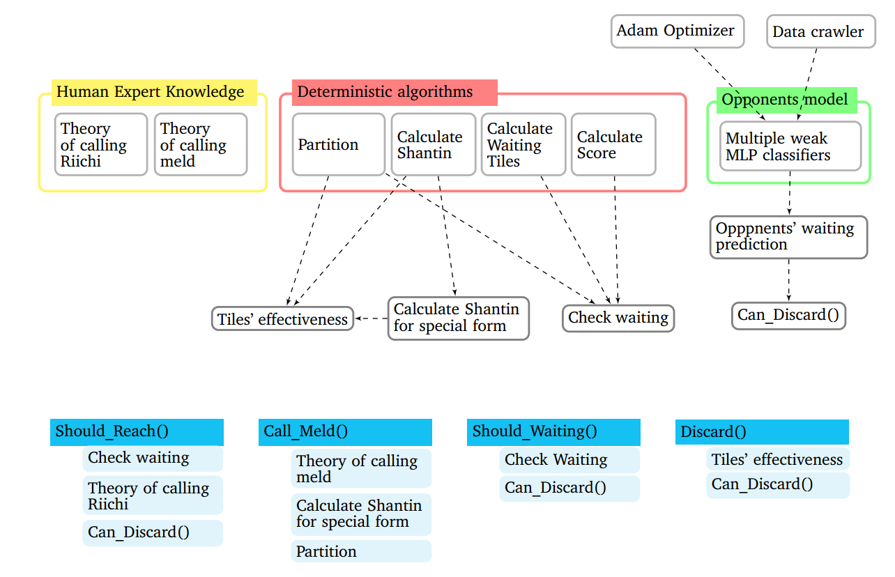
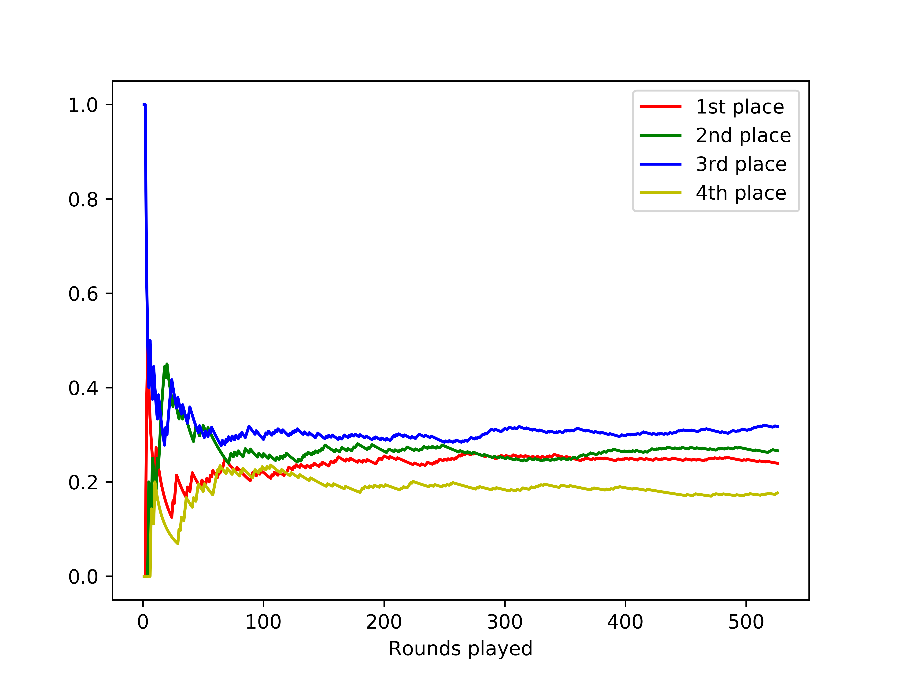
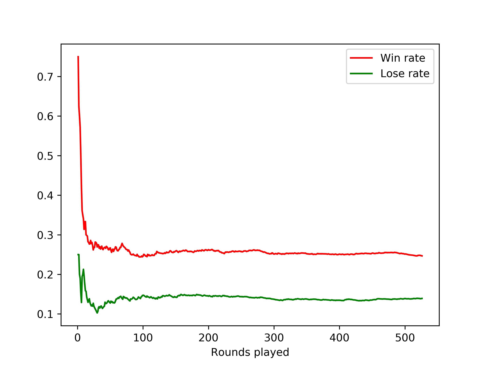
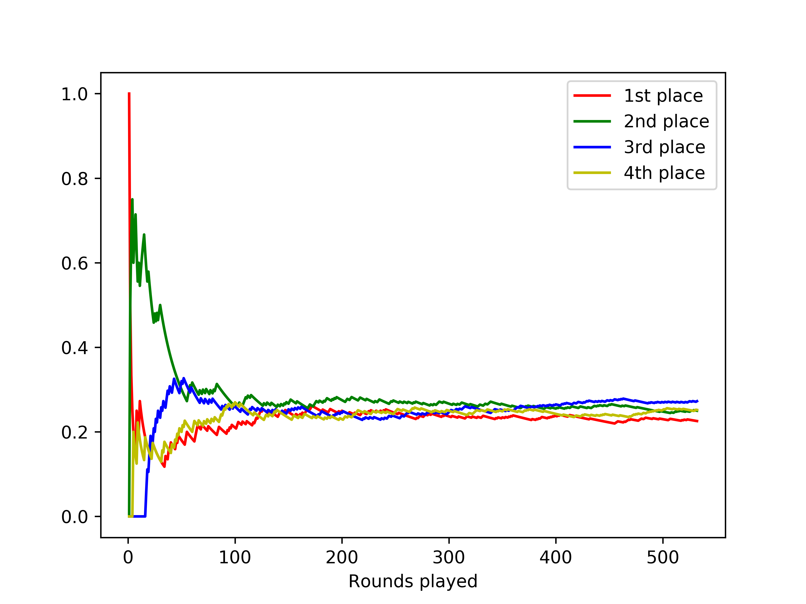
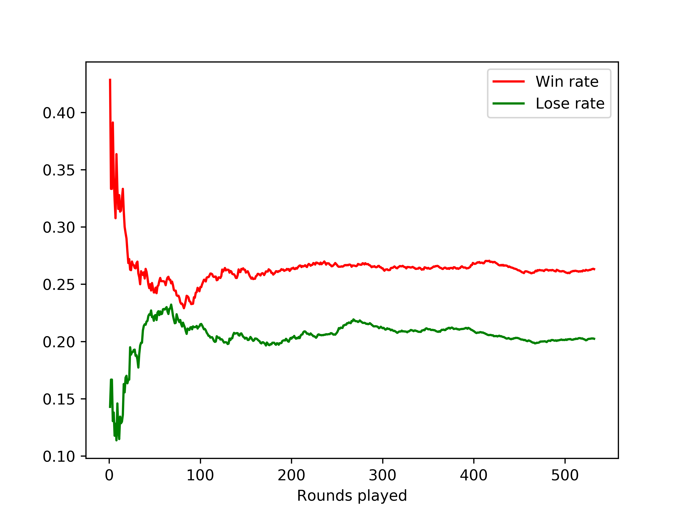

# README -- MahjongAI

### I'm so sorry that I didn't update anything these days. Because of moving and starting new job I'm so busy. The next update or better documentation will come whenever I would really have time. 

#### Mahjong is a "Constraint satisfaction optimisation" multiplayer strategic board game

This is a project for my master's thesis. Anyone who is interested in making powerful Mahjong AI is welcome to extend my agent. For more details about the applied algorithms and the reasons why such algorithms are used, please contact me with E-Mail. 

In the case that you want to develop your own Mahjong agent, this Repo can also be used as a Framework for realtime testing (***with real human players***). Then you can save all your time for finding the best strategy for your agent. Furthermore a development library (crawling and pre-processing of game logs, calculation of shantin and winning score etc.) is now available in: https://github.com/erreurt/MahjongKit

**Next Update coming soon**: 

1. ***Better feature engineering needed*** Decide whether to call a meld/call Riichi or not using Random Forest (Instead of condition-rules).

2. ***Ongoing***: Training waiting tiles prediction model with LSTM. 

**Attention**: If you test your bot parallelly with more than 4 accounts under the same IP adresse, your IP adress will be banned by tenhou.net for 24 hours. (I don't know exactly about the rules of banning players, but that's all inferred from my observation.)

|Author|Jianyang Tang (Thomas)|
|---|---
|E-mail|jian4yang2.tang1@gmail.com

****

# Summary
Mahjong is a four player strategy game with imperfect information. The main challenges of developing an intelligent Mahjong agent are for example the complicated game rules, the immense search space, multiple opponents and imperfect information. Several existing works have attempted to tackle these problems through Monte Carlo tree simulation, utility function fitting by supervised learning or opponents model by regression algorithms. Nevertheless, the performance of intelligent Mahjong playing agents is still far away from that of the best human players. Based on statistical analysis for the Mahjong game and human expert knowledge, an intelligent Mahjong agent was proposed in this work. To tackle the problems of the state-of-the-art work, heuristics technologies and an enhanced opponents model achieved by adopting bagging of multilayer perceptrons were applied to this work. The experiments show that the proposed agent outperforms the state-of-the-art agent, and the applied opponents model has a significant positive effect on the performance of the agent. Furthermore, several interesting points can be discerned from the experiments, which are pretty meaningful for future work.

****

# Contents
* [1. Japanese Riichi Mahjong: Game rules](#rules)
* [2. Directory of the program](#dir)
* [3. Overview of the Mahjong bot](#over)
* [4. Experiments result of the bot](#res)
* [5. Instructions I: Run the proposed Mahjong bot](#run)
* [6. Instructions II: Develop your own Mahjong bot](#dev)
* [Acknowledgments](#ack)


***

# <a name="rules"></a>1. Game rules of Japanese Riichi Mahjong
Refer to https://en.wikipedia.org/wiki/Japanese_Mahjong for game rules of Japanese Riichi Mahjong. 

The implemented client allows one to run a Mahjong agent directly through the programm, instead of doing this in the web browser. The site for online playing of Japanese Riichi Mahjong is http://tenhou.net/

### The Mahjong table
The left side is a typical scenary of Japanese Riichi Mahjong table. This picture is screenshot from the GUI implemented for debugging use.



***

# <a name="dir"></a>2. Directory of the program and short explanations

* **[MahjongAI]**
   * **[agents]** Agent 
      * **[utils]**
         * **[clfs]**
            * multiple multilayer perceptrons classifiers <sub>several MLP classifiers for predicting dangerous tiles</sub>
            * ......
         * ***wait_calc.py*** <sub>contains functions that calculate whether the hand tiles are in waiting state, return the corresponding winning score, the partition, the to be discarded tile</sub>
         * ***win_calc.py*** <sub>contains functions that calculate the winning score for a specific partition of hand tiles</sub>
      * ***ai_interface.py*** <sub>the class that should be inherited while developing your own Mahjong agent</sub>
      * ***experiment_ai.py*** <sub>the old agent which was used in the experiments</sub>
      * ***jianyang_ai.py*** <sub>the up-to-date agent</sub>
      * ***random_ai_example.py*** <sub>the example Mahjong agent class for giving a simple explanation on how to develop your own Mahjong agent</sub>
   * **[client]** For realtime testing with human beings
      * **[tilespng]** <sub>Pics used for GUI</sub>
      * ***mahjong_meld.py*** <sub>class of Mahjong meld</sub>
      * ***mahjong_tile.py*** <sub>class of Mahjong tile</sub>
      * ***mahjong_table.py*** <sub>class of Mahjong game table, for storing game state</sub>
      * ***mahjong_player.py*** <sub>class of Mahjong player, for storing players' tiles and game status</sub>
      * ***tenhou_client.py*** <sub>class of client for tenhou.net. This class implements the game just as the browser version</sub>
      * ***tenhou_parser.py*** <sub>class of parser for tenhou.net server. It provides decoding methods for messages reveived from the tenhou.net server</sub>
   * **[logger]** Recording the playing history of the agent while testing
      * ***logger_handler.py*** <sub>class of logging, for storing game run and game results</sub>
   * ***main.py*** <sub>contains example of how to run the Mahjong agent</sub>
   * ***gui_main.py*** <sub>contains example of how to run the Mahjong agent with GUI</sub>

***

# <a name="over"></a>3. Overview of the proposed Mahjong bot

### Discard policy


### Overview of the implementation


# <a name="res"></a>4. Performance of the proposed Mahjong agent

The proposed Mahjong agent was tested on tenhou.net. The test was carried out in two versions, i.e. one with defence model and another one without. The raw game logs and intermediate game results can be found in my another repository: https://github.com/erreurt/Experiments-result-of-mahjong-bot. The experiments were carried out with the agent version in ***experiment_ai.py***.

### 4.1. Convergence behavior of agent's performance

For the version with defence model, 526 games were played, and for the version without defence model, 532 games were played. This is not as many as two related works, but as shown in the figure of the convergence behavior of agent's performance, 526 games are sufficient.

#### Convergence behavior of agent's performance ***with*** defence model



#### Convergence behavior of agent's performance ***without*** defence model



### 4.2. Agent's performance compared to that of two related works

Mizukami's extended work can be seen as currently the best and the most reliable Mahjong agent in English literatures. Here a comparison between the performance of my Mahjong agent and that of Mizukami's is presented:

   |  | [1] | [2] | [3] | [4] |
   | ---------- | ----------- | ----------- | ----------- | ----------- |
   | Games played | 526 | 532 | 2634 | 1441 |
   | 1st place rate | 23.95% | 22.65% | 24.10% | 25.30% |
   | 2nd place rate | 26.62% | 25.92% | 28.10% | 24.80% |
   | 3rd place rate | 31.75% | 25.71% | 24.80% | 25.10% |
   | 4th place rate | ***17.68%*** | 25.71% | 23.00% | 24.80% |
   | win rate | 24.68% | 26.50% | 24.50% | 25.60% |
   | lose rate | 13.92% | 20.21% | 13.10% | 14.80% |
   | fixed level | 2.21 Dan | 0.77 Dan | 1.14 Dan | 1.04 Dan |
   
   * ***[1]*** My Mahjong agent ***with*** defence model
   
   * ***[2]*** My Mahjong agent ***without*** defence model
   
   * ***[3]*** **Mizukami's extended work**: Mizukami N., Tsuruoka Y.. *Building a computer mahjong player based on monte carlo
simulation and opponent models.* In: 2015 IEEE Conference on Computational Intelligence
and Games (CIG), pp. 275–283. IEEE (2015)

   * ***[4]*** **Mizukami et. al.**: N. Mizukami, R. Nakahari, A. Ura, M. Miwa, Y. Tsuruoka, and T. Chikayama. *Realizing
a four-player computer mahjong program by supervised learning with isolated multi-player
aspects.* Transactions of Information Processing Society of Japan, vol. 55, no. 11, pp. 1–11,
2014, (in Japanese).

Note that while playing Mahjong, falling into 4th place is definitely a taboo, since one would get level points reduced. As a result, the rate of falling into 4th place of a player is critical to its overall performance. My bot has a better fixed level exactly due to the low 4th place rate. 

***

# <a name="run"></a>5. How to run the proposed Mahjong agent?
To run the Mahjong agent, one has to specify a few configurations. As shown in the following example from main.py:
```python
def run_example_ai():
    ai_module = importlib.import_module("agents.random_ai_example")
    ai_class = getattr(ai_module, "RandomAI")
    ai_obj = ai_class()  # [1]
    player_module = importlib.import_module("client.mahjong_player")
    opponent_class = getattr(player_module, "OpponentPlayer")  # [2]
    user = "ID696E3BCC-hLHNE8Wf"  # [3]
    user_name = "tst_tio"  # [4]
    game_type = '1'  # [5]
    logger_obj = Logger("log1", user_name)  # [6]
    connect_and_play(ai_obj, opponent_class, user, user_name, '0', game_type, logger_obj)  # play one game
```

```python
def run_jianyang_ai():
    ai_module = importlib.import_module("agents.jianyang_ai")
    waiting_prediction_class = getattr(ai_module, "EnsembleCLF")
    ensemble_clfs = waiting_prediction_class()
    ai_class = getattr(ai_module, "MLAI")
    ai_obj = ai_class(ensemble_clfs)  # [1]
    opponent_class = getattr(ai_module, "OppPlayer")  # [2]
    user = "ID696E3BCC-hLHNE8Wf"  # [3]
    user_name = "tst_tio"  # [4]
    game_type = '1'  # [5]
    logger_obj = Logger("log_jianyang_ai_1", user_name)  # [6]
    connect_and_play(ai_obj, opponent_class, user, user_name, '0', game_type, logger_obj)

```

1. **AI instance**: A class instance of the Mahjong agent. In this repository three versions of Mahjong agent are provided. The first one is in ***agents.random_ai_example.py***, this is a demo class for showing potential developers how to implement his/her own agents. The second one is in ***agents.experiment_ai.py*** and the experiment results given in part 4 is generated by this AI. The third one is the up-to-date AI and is in ***agents.jianyang_ai.py***.

2. **Opponent player class**: The class of Opponent player. One can use the default class OpponentPlayer in ***client.mahjong_player***. If one has extended the OpponentPlayer class due to extra needs, this variable should be set to your corresponding class.

3. **User ID**: A token in the form as shown in the example that one got after registration on tenhou.net. ***ATTENTION: Please use your own user ID. If the same ID is used under different IP address too often, the account will be temperorily blocked by tenhou.net.***

4. **User name**: The corresponding user name you have created while registrating on tenhou.net. This variable is only for identifying your test logs. 

5. **Game type**: The game type is encoded as a 8-bit integer. Followings are the description for each bit.

    * 0-th: 1 play with online players, 0 play with robots
    * 1-th: 1 no red bonus tiles, 0 with red bonus tiles
    * 2-th: 1 no open tanyao, 0 with open tanyao
    * 3-th: 1 only east+south round (regurarily 8 rounds), 0 only east round (4 rounds)
    * 4-th: 1 three players (two opponents), 0 four players (three opponents)
    * 6-th: 1 fast game (7s for decision making), 0 slow game (15s)
    * 5-th & 7-th: game room 00-starter, 01-upper, 10-mega upper, 11-phoenix
    
    For examples:
    
    * "1" = "00000001": with online real human players, with red bonus tiles, with open tanyao, 4 rounds, 4 players, slow game, starter game room
    * "137" = "10001001": with online real human players, with red bonus tiles, with open tanyao, 8 rounds, 4 players, slow game, upper game room
    * "193" = "11000001": with online real human players, with red bonus tiles, with open tanyao, 4 rounds, 4 players, fast game, upper game room
    
    ```diff
    - Tenhou.net does not provide all possibility of the above specified combinations. Most online players play on configurations for example "1", "137", "193", "9"
    ```

6. **Logger**: Two parameters are required for initialising the logger. The first one is the user-defined logger's ID, such that developers can freely name his/her test history. 

After specifying all these configurations, just throw all these parameters to **connect_and_play()**. Then it's time watch the show of your Mahjong agent!!!

***

# <a name="dev"></a>6. How to develop your own Mahjong agent?

### 6.1. Output: What functions should be implemented?

Four functions must be implemented for the Mahjong bot, as shown in the "interface" class in ***agents.ai_interface***. It is recommended that your agent is an inheritance of the AIInterface. For a deeper explanation and a simple example of these functions, please see documentation in ***agents.random_ai_example.py***.

```python
class AIInterface(MainPlayer):

    def to_discard_tile(self):
        raise NotImplementedError

    def should_call_kan(self, tile136, from_opponent):
        raise NotImplementedError

    def try_to_call_meld(self, tile136, might_call_chi):
        raise NotImplementedError

    def can_call_reach(self):
        raise NotImplementedError
```

   * ***to_discard_tile***: Based on all the accessible information about the game state, this function returns a tile to discard. The return is an integer in the range 0-135. There are toally 136 tiles in the Mahjong game, i.e. 34 kinds of tiles and 4 copies for each kind. In different occasions we use either the 34-form (each number corresponds to one kind of tile) or the 136-form (each number corresponds to a tile). Note that here the return should be in the 136-form.
   
   * ***should_call_kan***: https://en.wikipedia.org/wiki/Japanese_Mahjong#Making_melds_by_calling. This function should decide whether the agent should call a kan(Quad) meld. ***tile136*** stands for the tile that some opponent has discarded, which can be used for the agent to form the kan meld. ***from_opponent*** indicates whether the agent forms the kan meld by opponent's discard (three tiles in hand and the opponent discards the fourth one) or own tiles(all four tiles in hand). 
   
   * ***try_to_call_meld***: https://en.wikipedia.org/wiki/Japanese_Mahjong#Making_melds_by_calling. This function decides whether the agent should call a Pon(Triplet)/Chi(Sequence) meld. ***tile136*** stands for the tile in 136-form that some opponents has discarded. ***might_call_chi*** indicates whether the agent could call a Chi meld, since a Chi meld can only be called with discard of opponent in the left seat.
   
   * ***can_call_reach***: https://en.wikipedia.org/wiki/Japanese_Mahjong#R%C4%ABchi. This function decides whether the agent should claim Riichi. 
   
### 6.2. Input: What information of the game state you have access to?

When the Mahjong agent class is a subclass of the ***AIInterface*** class, information listed as follows can be accessed inside the agent class as specified.

#### **(1) Agent's own game state**

   | Access  | Data type | Mutable | Desription |
   | ---------- | ----------- | ----------- | ----------- |
   | <sub>self.tiles136</sub> | <sub>list of integers</sub> | <sub>Y</sub> | <sub>hand tiles in 136-form</sub> |
   | <sub>self.hand34</sub> | <sub>list of integers</sub> | <sub>N</sub> | <sub>hand tiles in 34-form (tile34 = tile136//4)</sub> |
   | <sub>self.discard136</sub> | <sub>list of integers</sub> | <sub>Y</sub> | <sub>the discards of the agent in 136-from</sub> |
   | <sub>self.discard34</sub> | <sub>list of integers</sub> | <sub>N</sub> | <sub>the discards of the agent in 34-form</sub> |
   | <sub>self.meld136</sub> | <sub>list of Meld instances</sub> | <sub>Y</sub> | <sub>the called melds of the agent, instances of class Meld in ***client.mahjong_meld.py***</sub> |
   | <sub>self.total_melds34</sub> | <sub>list of list of integers</sub> | <sub>N</sub> | <sub>the called melds of the agent in 34-form</sub> |
   | <sub>self.meld34</sub> | <sub>list of list of integers</sub> | <sub>N</sub> | <sub>the called pon/chow melds of the agent in 34-form</sub> |
   | <sub>self.pon34</sub> | <sub>list of list of integers</sub> | <sub>N</sub> | <sub>the called pon melds of the agent in 34-form</sub> |
   | <sub>self.chow34</sub> | <sub>list of list of integers</sub> | <sub>N</sub> | <sub>the called chow melds of the agent in 34-form</sub> |
   | <sub>self.minkan34</sub> | <sub>list of list of integers</sub> | <sub>N</sub> | <sub>the called minkan melds of the agent in 34-form</sub> |
   | <sub>self.ankan34</sub> | <sub>list of list of integers</sub> | <sub>N</sub> | <sub>the called ankan melds of the agent in 34-form</sub> |
   | <sub>self.name</sub> | <sub>string</sub> | <sub>Y</sub> | <sub>name of the account</sub> |
   | <sub>self.level</sub> | <sub>string</sub> | <sub>Y</sub> | <sub>level of the account</sub> |
   | <sub>self.seat</sub> | <sub>integer</sub> | <sub>Y</sub> | <sub>seat ID, the agent always has 0</sub> |
   | <sub>self.dealer_seat</sub> | <sub>integer</sub> | <sub>Y</sub> | <sub>the seat ID of the dealer</sub>  |
   | <sub>self.is_dealer</sub> | <sub>boolean</sub> | <sub>N</sub> | <sub>whether the agent is dealer or not</sub> |
   | <sub>self.reach_status</sub> | <sub>boolean</sub> | <sub>Y</sub> | <sub>indicates whether the agent has claimed Riichi</sub> |
   | <sub>self.just_reach()</sub> | <sub>boolean</sub> | <sub>N</sub> | <sub>whether the agent just claimed Riichi</sub> |
   | <sub>self.tmp_rank</sub> | <sub>integer</sub> | <sub>Y</sub> | <sub>rank of the agent in the current game</sub> |
   | <sub>self.score</sub> | <sub>integer</sub> | <sub>Y</sub> | <sub>score of the agent in the current game</sub> |
   | <sub>self.is_open_hand</sub> | <sub>boolean</sub> | <sub>N</sub> | <sub>whether the agent has already called open melds</sub> |
   | <sub>self.turn_num</sub> | <sub>integer</sub> | <sub>N</sub> | <sub>the number of the current turn</sub> |
   | <sub>self.player_wind</sub> | <sub>integer</sub> | <sub>N</sub> | <sub>player wind is one kind of [yaku](https://en.wikipedia.org/wiki/Japanese_Mahjong#Yaku_and_yakuman)</sub> |
   | <sub>self.round_wind</sub> | <sub>integer</sub> | <sub>N</sub> | <sub>round wind is one kind of [yaku](https://en.wikipedia.org/wiki/Japanese_Mahjong#Yaku_and_yakuman)</sub> |
   | <sub>self.bonus_honors</sub> | <sub>list of integers</sub> | <sub>Y</sub> | <sub>all the character tiles which have [yaku](https://en.wikipedia.org/wiki/Japanese_Mahjong#Yaku_and_yakuman)</sub> |
   
   
#### **(2) Opponents' game state**
   One can access to the instance of opponent class by calling ***self.game_table.get_player(i)*** with i equals 1,2,3, which indicates the corresponding id of the opponent.  
   
   | Access  | Data type | Mutable | Desription |
   | ---------- | ----------- | ----------- | ----------- |
   | <sub>.discard136</sub> | <sub>list of integers</sub> | <sub>Y</sub> | <sub>the discards of the observed opponent in 136-from</sub> |
   | <sub>.discard34</sub> | <sub>list of integers</sub> | <sub>N</sub> | <sub>the discards of the observed opponent in 34-form</sub> |
   | <sub>.meld136</sub> | <sub>list of ***Meld*** instances</sub> | <sub>Y</sub> | <sub>the called melds of the observed opponent
   | <sub>.total_melds34</sub> | <sub>list of list of integers</sub> | <sub>N</sub> | <sub>the called melds of the observed opponent  in 34-form</sub> |
   | <sub>.meld34</sub> | <sub>list of list of integers</sub> | <sub>N</sub> | <sub>the called pon/chow melds of the observed opponent  in 34-form</sub> |
   | <sub>.pon34</sub> | <sub>list of list of integers</sub> | <sub>N</sub> | <sub>the called pon melds of the observed opponent  in 34-form</sub> |
   | <sub>.chow34</sub> | <sub>list of list of integers</sub> | <sub>N</sub> | <sub>the called chow melds of the observed opponent  in 34-form</sub> |
   | <sub>.minkan34</sub> | <sub>list of list of integers</sub> | <sub>N</sub> | <sub>the called minkan melds of the observed opponent  in 34-form</sub> |
   | <sub>.ankan34</sub> | <sub>list of list of integers</sub> | <sub>N</sub> | <sub>the called ankan melds of the observed opponent  in 34-form</sub> |
   | <sub>.safe_tiles</sub> | <sub>list of integers</sub> | <sub>Y</sub> | <sub>tiles in 34-form which are absolutely safe for the agent, i.e. the observed opponent cannot win with these tiles</sub> |
   | <sub>.name</sub> | <sub>string</sub> | <sub>Y</sub> | <sub>name of the opponent</sub> |
   | <sub>.level</sub> | <sub>string</sub> | <sub>Y</sub> | <sub>level of the opponent</sub> |
   | <sub>.seat</sub> | <sub>integer</sub> | <sub>Y</sub> | <sub>seat ID of the observed opponent</sub> |
   | <sub>.dealer_seat</sub> | <sub>integer</sub> | <sub>Y</sub> | <sub>the seat ID of the dealer</sub>  |
   | <sub>.is_dealer</sub> | <sub>boolean</sub> | <sub>N</sub> | <sub>whether the observed opponent is dealer or not</sub> |
   | <sub>.reach_status</sub> | <sub>boolean</sub> | <sub>Y</sub> | <sub>indicates whether the observed opponent has claimed Riichi</sub> |
   | <sub>.just_reach()</sub> | <sub>boolean</sub> | <sub>N</sub> | <sub>whether the observed opponent just claimed Riichi</sub> |
   | <sub>.tmp_rank</sub> | <sub>integer</sub> | <sub>Y</sub> | <sub>rank of the observed opponent in the current game</sub> |
   | <sub>.score</sub> | <sub>integer</sub> | <sub>Y</sub> | <sub>score of the observed opponent in the current game</sub> |
   | <sub>.is_open_hand</sub> | <sub>boolean</sub> | <sub>N</sub> | <sub>whether the observed opponent has already called open melds</sub> |
   | <sub>.turn_num</sub> | <sub>integer</sub> | <sub>N</sub> | <sub>the number of the current turn</sub> |
   | <sub>.player_wind</sub> | <sub>integer</sub> | <sub>N</sub> | <sub>player wind is one kind of [yaku](https://en.wikipedia.org/wiki/Japanese_Mahjong#Yaku_and_yakuman)</sub> |
   | <sub>.round_wind</sub> | <sub>integer</sub> | <sub>N</sub> | <sub>round wind is one kind of [yaku](https://en.wikipedia.org/wiki/Japanese_Mahjong#Yaku_and_yakuman)</sub> |
   | <sub>.bonus_honors</sub> | <sub>list of integers</sub> | <sub>Y</sub> | <sub>all the character tiles which have [yaku](https://en.wikipedia.org/wiki/Japanese_Mahjong#Yaku_and_yakuman)</sub> |
   
#### **(3) Information about the game table**

To access information about the game table, one can call ***self.game_table***

   | Access | Data type | Mutable | Desription |
   | ---------- | ----------- | ----------- | ----------- |
   | <sub>.bot</sub> | <sub>instance of agent class</sub> | <sub>Y</sub> | <sub>class instance of the agent</sub> |
   | <sub>.get_player(i)</sub> | <sub>instance of opponent class</sub> | <sub>Y</sub> | <sub>class instance of the opponent, i=1,2,3</sub> |
   | <sub>.dealer_seat</sub> | <sub>integer</sub> | <sub>Y</sub> | <sub>seat ID of the dealer</sub> |
   | <sub>.bonus_indicator</sub> | <sub>list of integers</sub> | <sub>Y</sub> | <sub>[bonus indicators](https://en.wikipedia.org/wiki/Japanese_Mahjong#Dora) in 136-form</sub> |
   | <sub>.round_number</sub> | <sub>integer</sub> | <sub>Y</sub> | <sub>round number</sub> |
   | <sub>.reach_sticks</sub> | <sub>integer</sub> | <sub>Y</sub> | <sub>How many Riichi sticks are on the table. The player who win next will receive all the points of these Riichi sticks</sub> |
   | <sub>.honba_sticks</sub> | <sub>integer</sub> | <sub>Y</sub> | <sub>How many honba sticks are on the table. The player will have extra points according to honba sticks if it wins</sub> |
   | <sub>.count_ramaining_tiles</sub> | <sub>integer</sub> | <sub>Y</sub> | <sub>The number of remaining unreavealed tiles</sub> |
   | <sub>.revealed</sub> | <sub>list of integers</sub> | <sub>Y</sub> | <sub>Each element in the list indicates how many copies of this specific tile has been revealed (discards, open melds, bonus indicators etc)</sub> |
   | <sub>.round_win</sub> | <sub>integer</sub> | <sub>N</sub> | <sub>round wind is one kind of [yaku](https://en.wikipedia.org/wiki/Japanese_Mahjong#Yaku_and_yakuman)</sub> |
   | <sub>.bonus_tiles</sub> | <sub>list of integers</sub> | <sub>N</sub> | <sub>List of bonus tiles. Each occurance of bonus tiles in hand tiles counts as a [yaku](https://en.wikipedia.org/wiki/Japanese_Mahjong#Yaku_and_yakuman)</sub> |
   | <sub>.last_discard</sub> | <sub>integer</sub> | <sub>N</sub> | <sub>The very latest discard of opponent, this tile is absolutely safe by rules</sub> |

***
# <a name="ack"></a>Acknowledgments

### Finally, I would like to warmly thank 
  
  * ***my professor Johannes Fürnkranz (TU Darmstadt Knowledge Engineering Group)*** 
  
  * ***my supervisor Tobias Joppen (TU Darmstadt Knowledge Engineering Group)***

### You made it possible for me to investigate Mahjong agent as my master's thesis. Thanks for letting me combining my hobbies with what I have learned in the university. 


